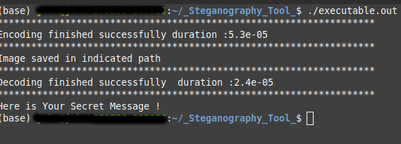

### Simple Steganography Tool 
###### Simple Tool for who wants to learn basic steganography.

- Important mention: in order to get results like below save image as png format lossy compressions like jpeg , jpg spoil text embedded into file) 

##### Usage
- To compile use run.sh shell script it will compile project
- To run project type to terminal : ./executable.out 

#### Results
#
#### Differences:

#
#### ScreenShot 

#
#### Original Images

#

